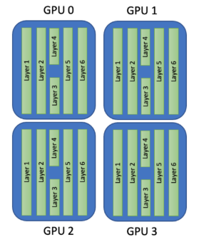
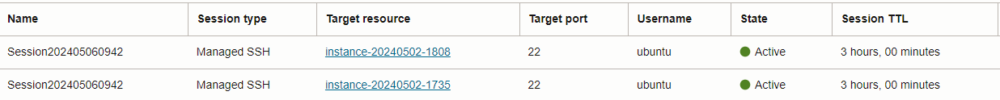
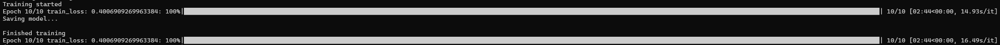
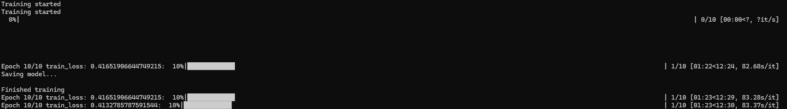
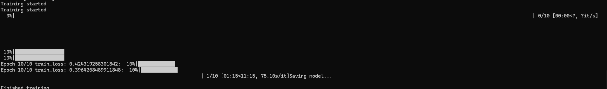
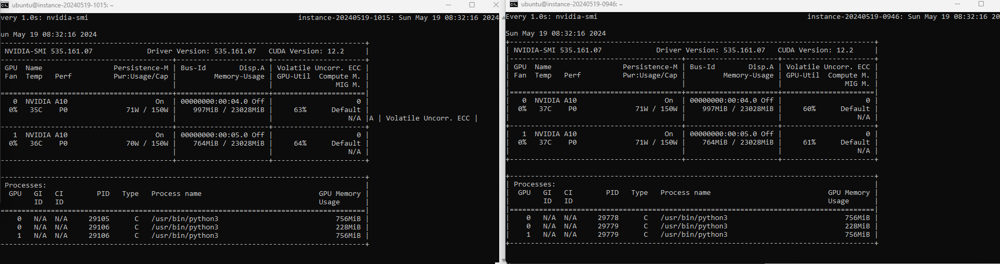

# How to run distributed multi-node training in practice on OCI

**Training deep learning models faster using PyTorch on OCI IaaS GPUs
Shapes.**

Deep neural networks have become increasingly complex and large in
recent years. As a result, training these models can be computationally expensive and
time-consuming. This is where parallelism comes in. Parallelism involves
breaking down the computation into smaller parts that can be executed
simultaneously on different computing resources. There are several types
of parallelism that can be used for deep learning training. The two most
common are data parallelism and model parallelism.

**\*\* This article will focus on Data parallelism only! \*\***

## Data parallelism

Data parallelism involves replicating the model across multiple
devices (usually multiple GPUs) and then dividing the training data into
subsets, with each device processing a different subset of the data.
During the forward and backward passes, each device calculates the
gradients independently and then communicates the gradients to the other
devices. The gradients are then averaged, and the model is updated
accordingly. This method is useful to speed up traning, as we can
process more data in parallel.




## Setup training

1.  First you go to OCI website and create an account.

2.  Then, after login, you search for **Compute-\> Instances** and open
    it.

    This will open a configuration page to launch a virtual machine
    instance.

    I used a virtual VM GPU shaped with 2 X Nvidia A10 typed: VM.GPU.A10.2
    with a pre-build image “NVIDIA GPU Cloud Machine Image” -\> [more details can be found here](https://cloudmarketplace.oracle.com/marketplace/en_US/listing/54854361).

    

    Both GPU shapes are on a public subnets yet you may consider private
    subnets for security reasons and that will be reached by **OCI bastion
    service** --- [more details can be found here](https://www.oracle.com/il-en/security/cloud-security/bastion/). For example it will look
    like this:

    

    - **Make sure that both GPU shapes are under the same VCN & same
    private subnet.**
    - **Make sure that security list allows ICMP & TCP
    ports/traffic**
    - **Set a debug flag for verbose logs on each GPU shape with the
    command: `export NCCL_DEBUG=INFO`**
    - **Set the name value to `NCCL_SOCKET_IFRAME` in each GPU Shape
    with the command -- for example: `export
    NCCL_SOCKET_IFRAME=eth0`**
    - **disable ubuntu firewall & allow all Iptables configuration
    and you may edit /etc/hosts as well**

3.  Install packages in the instance: (should be done for both nodes)  
    pip3 install torch torchvision torchaudio tqdm

## Single GPU (non-parallel)

We will start with a single GPU training as the basis code, which will
be adapted to multi-GPU data parallel training on the next section.In
this script, we have a simple training running on the GPU 0.
Refer to train.py attached at Github repo
You can save this script to a `train.py` file and run `python train.py`

    result: (training time: 2.44 sec)



Now that we have the base code for training, I will explain how adapt
it to multi-GPU data parallel training.

## Distributed environment setup

First, we will add the following piece of code at beginning of the
training script:

- At beginning, we set the URL for the communication between
  nodes/GPUs.  

  The default value is `env://`, which works with
  torch.distributed.launch and torch.run.

- The next few lines of code retrieve the rank, world_size, and
  local_rank of the current process from the environment variables.
  These values are used to specify the order of the current process
  within all the processes, the total number of processes, and the order
  of the current process within the node it is running on, respectively.
  In this case, with a single node with 4 GPUs, the `world_size` will be
  4, and the `rank` and `local_rank` values will range from 0 to 3 within
  their respective processes, which will be running on its respective
  GPU.

- The `dist.init_process_group()` function initializes the process group
  with the specified backend, init_method, world_size, and rank. This
  function creates a communication group for all the processes, allowing
  them to communicate and synchronize with each other during training.

- The `dist.barrier()` function synchronizes all the processes to reach
  this point before moving on, ensuring that all processes are ready for
  training and preventing any processes from starting before others are
  ready.

- **Data sampling** - In distributed training, it is important to ensure
  that each process sees a unique subset of the training data during
  each epoch to avoid duplicated work and to make sure the model is
  exposed to the entire dataset. This is why we need to use a sampler to
  shuffle and partition the training dataset across the different
  processes. In our code we wiil define it using the below code:  
    
      ```
      train_dataset = CIFAR10(root='./data', train=True,
      transform=train_transform, download=False)

      train_sampler = DistributedSampler(dataset=train_dataset,
      shuffle=True, num_replicas=world_size, rank=rank)

      train_loader = DataLoader(train_dataset, batch_size=batch_size,
      sampler=train_sampler)
      ```

  In this code snippet, we are creating a `DistributedSampler` object
  with `num_replicas` set to `world_size` (which is the number of
  processes), and `rank` set to the rank of the current process.
  The `DistributedSampler` will divide the training dataset
  into `num_replicas` chunks and each process will receive one of those
  chunks based on its `rank`. This ensures that each process sees a unique
  subset of the data.If we did not use that, each model replica would
  see the same sequence of the dataset on each process, which would lead
  to duplicated work and harm the model training.

- **Model** - In this data parallel training, we will
  use `DistributedDataParallel`, which is a PyTorch module that allows you
  to parallelize the training of your deep learning models across
  multiple GPUs.

      ```
      # Create the model
      model = torch.hub.load('pytorch/vision:v0.10.0', 'resnet18',
      pretrained=False)

      # Change model head classifier to dataset num_classes
      model.fc = nn.Linear(512, 10)

      # Move the model to device
      model.to(local_rank)
      model = DistributedDataParallel(model, device_ids=\[local_rank\])
      ```

      This modification wraps the model with `DistributedDataParallel` to
      enable distributed training. The `device_ids` argument specifies the GPU
      that the model will be trained on. Thus, each model replica will run
      on a different process on its respective GPU, identified
      by `local_rank.` In our single-node with 4 GPUs case, we have 4 model
      replicas, each running by 4 different processes and each process is
      running in a different GPU.

- **Training** - In this data parallel training, we will
  use `DistributedDataParallel`, which is a PyTorch module that allows you
  to parallelize the training of your deep learning models across
  multiple GPUs.

      ```
      for epoch in range(num_epochs):
      train_loader.sampler.set_epoch(epoch)
      running_loss = 0.0
      for i, data in enumerate(train_loader):
      inputs, labels = data
      inputs, labels = inputs.to(local_rank), labels.to(local_rank)
      optimizer.zero_grad()
      outputs = model(inputs)
      loss = criterion(outputs, labels)
      loss.backward()
      optimizer.step()
      running_loss += loss.item()
      ```

      In distributed training, each process will have its own instance of
      the data loader, and the sampler will ensure that each process gets a
      different subset of the data to train on. By setting the epoch for the
      sampler, we ensure that each process gets a different set of data
      samples in each epoch, which helps to improve the diversity of the
      data seen by the model during training. We can do that by
      using `train_loader.sampler.set_epoch(epoch)` on each epoch.

      The other modification is that `inputs` and `labels` are now being moved
      to the GPU that is associated with the current process, which is
      identified by the `local_rank` variable.

### **Saving data to disk**

```python
if local_rank == 0:
print("Saving model...")
torch.save(model.state_dict(), "model.pth")
print('\nFinished training')
```

We use `local_rank == 0` as a condition to ensure that only one process
(specifically, the one with local rank 0) saves the final trained
model and prints the message "Finished training". In a distributed
training setting, all processes are training the model in parallel,
and it would be redundant for each process to save the model or print
the message. Therefore, we use the `local_rank == 0` condition to ensure
that only one process does these actions.

### **Running the script**

In order to run the training, we will use `torch.distributed.run`, which
is a PyTorch utility that simplifies the process of running
distributed training. It provides a simple API for launching a
distributed training job and automatically handles tasks such as
setting up the distributed environment, initializing processes, and
aggregating results.

We will save the data parallel training script in a `train1.py` file -
Refer to train1.py attached at Github repo.
run on terminal with:

```console
python -m torch.distributed.run --nnodes=1 --nproc-per-node=2
train1.py
```



The `--nnodes` argument specifies the number of nodes being used, while
the `-nproc-per-node` argument specifies the number of processes to be
launched per node.

```console
result: (training time: 1.23 sec); **49.59% reduction in training time
from the single GPU result!**
```

## Results and discussions

Since we are using data parallel training with multiple GPUs, the
training is much faster than using the same settings running on a
single GPU. One of the reasons for this is that since each GPU
processes `batch_size=64` samples per step, by using 4 GPUs results in
processing a total of `64\*4=256` samples per step.

## Multi-node Multi GPU Data Parallel

An approach to increase the computational power available to speed up training is by using multiple GPUs. However, using multiple GPUs in a single machine can sometimes be limited by hardware constraints. For example, as of today, most OCI instance types have a maximum of 8 GPUs available per machine. To overcome these limitations, it is common to use multiple machines connected over a network to run distributed GPU training. This approach is known as distributed training and involves dividing the training workload across multiple machines, each with their own set of GPUs.


## Setup

Connect to the GPU shapes machines you have launched before, copy the training files (`train.py` & `train1.py`), install the packages and run `torch.distributed.run` command in each of them, but with some modifications.

For one GPU shape run the command:

```console
python -m torch.distributed.run \\  
--nproc_per_node=2 \\  
--nnodes=2 \\  
--node_rank=0 \\  
--master_addr=XX.XX.XX.XX \\  
--master_port=12345 \\  
train1.py
```

For the second GPU run the command:  

```console
python -m torch.distributed.run \\  
--nproc_per_node=2 \\  
--nnodes=2 \\  
--node_rank=1 \\  
--master_addr= XX.XX.XX.XX \\  
--master_port=12345 \\  
train1.py
```

- `--nproc_per_node`: Specifies the number of GPUs to use in the node you are running. In our example, both 2 nodes run with 4 GPUs. You can set different values on each node individually.

- `--nnodes`: Specifies the total number of nodes (machines) participating in the distributed training job.

- `--node_rank`: Specifies the rank of the current node, where you must set a unique value for each node, varying from 0 to `--nnodes`.

- `--master_addr`: Specifies the IP address of the machine that is running the master process. In order to set that, you need to choose one of the machines to be the master node. You can choose any instance to be the master, but it is usually a good idea to choose an instance with good network connectivity and sufficient resources to handle the coordination tasks. You can obtain the IP address of the master instance in the console page by clicking on the selected instance.  --master_port: Specifies the port number that the master process is listening on.  train1.py: Specifies the training script to run.



result: (training time: 1.15 sec); **52.87% reduction in training time
from single GPU training! And 6.5% reduction in training time from
single node with multi-GPU training!**

You can see a snapshot with the nvidia-smi command the utilization of
all GPUs on all Nodes below:  
  

