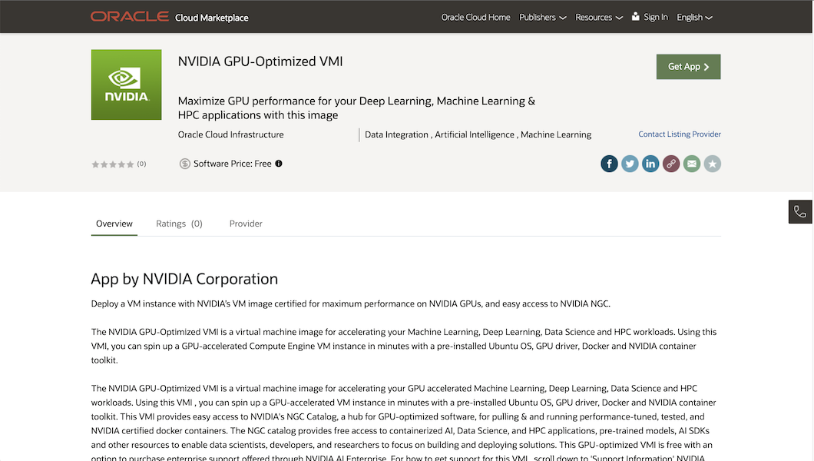
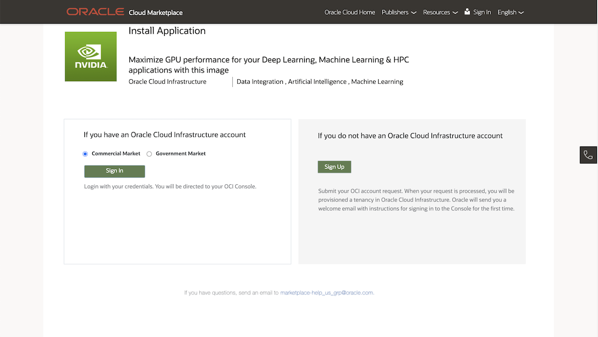
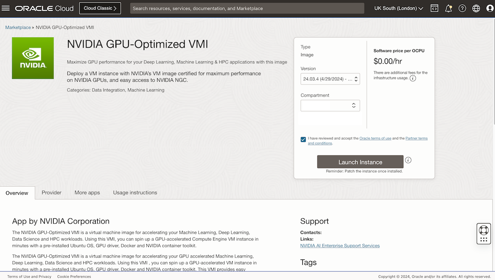
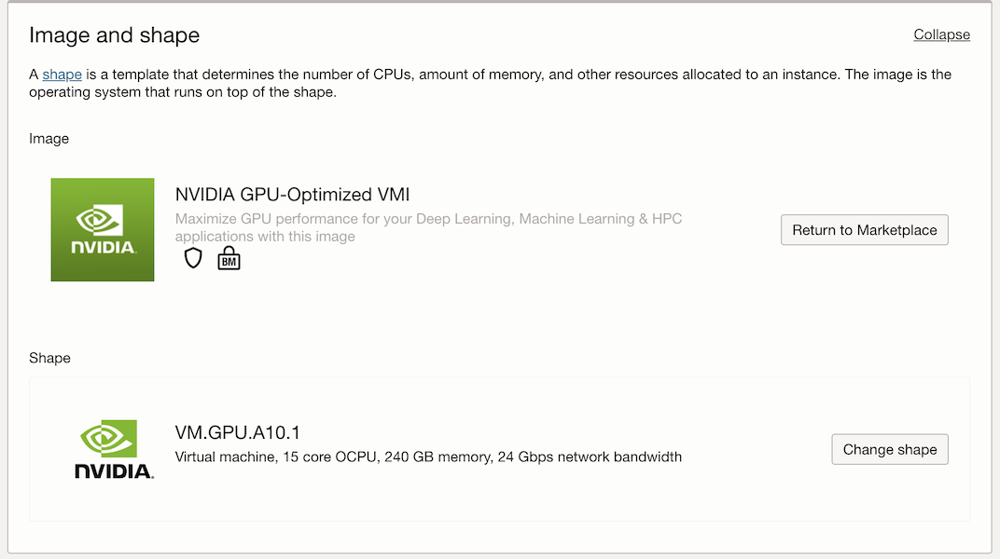
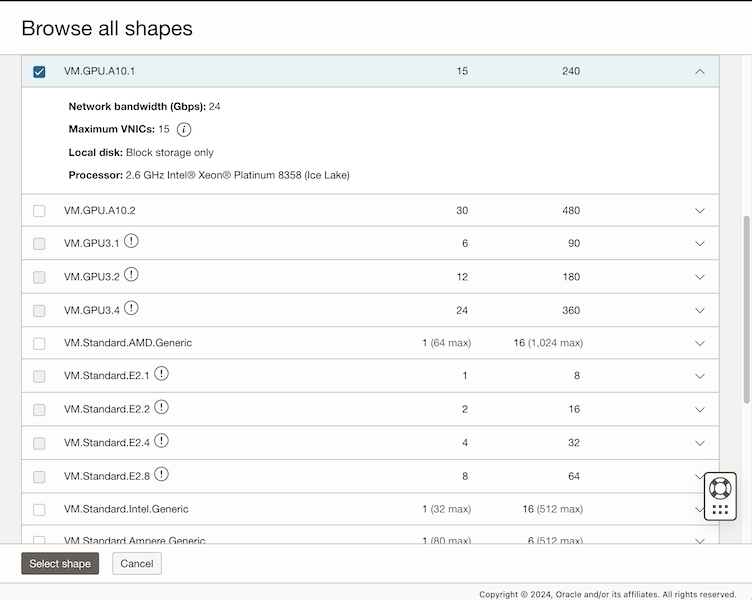
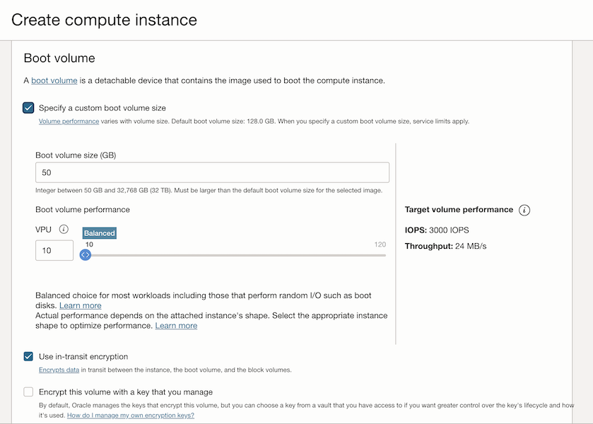
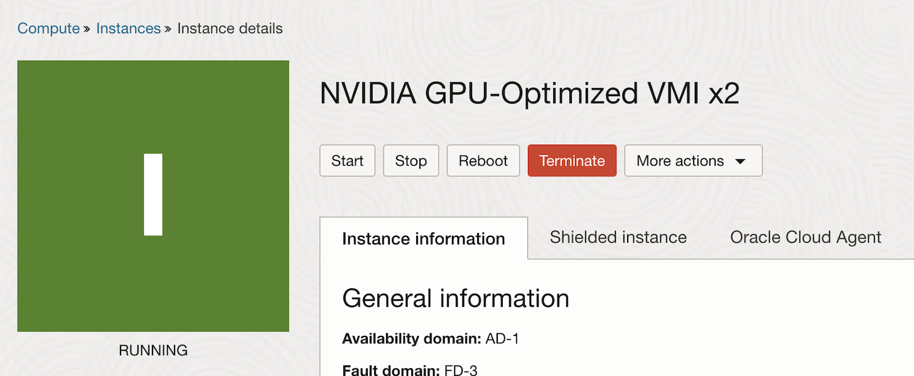
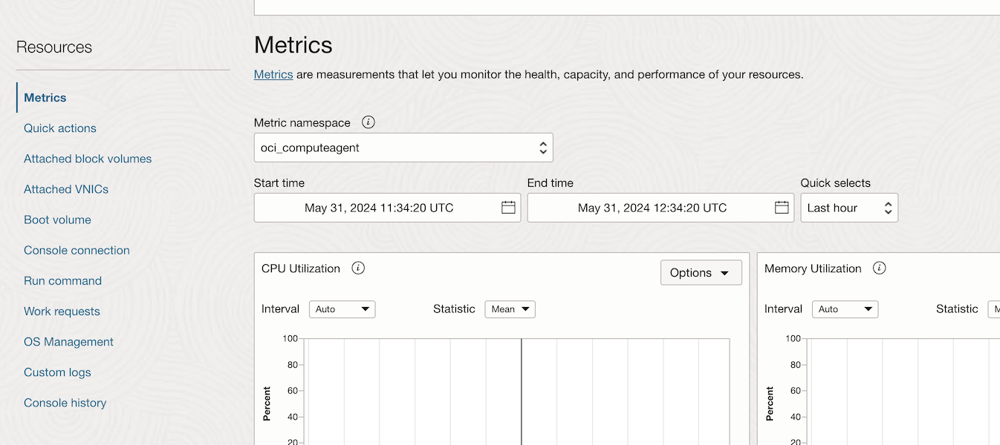
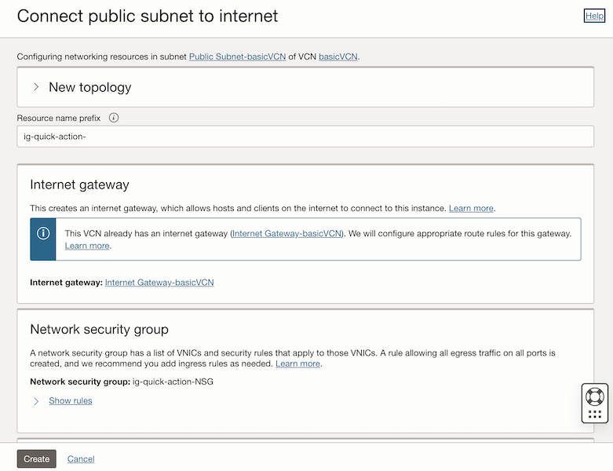
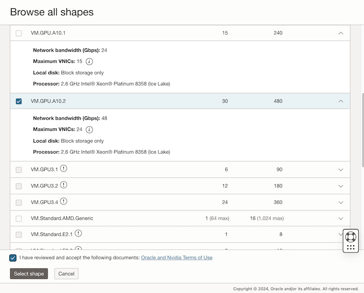

# Using Parallelism to Run Deep Neural Network Training

By utilizing powerful NVIDIA GPUs and techniques like data parallelism, you can train your custom AI models faster.

Using multiple GPUs on a single node offers a performance boost, hardware limitations might restrict the number of available GPUs. To overcome this, we can leverage distributed training across multiple OCI instances here we have 2 nodes connected over a network.

This is where parallelism comes in. Parallelism involves breaking down the computation into smaller parts that can be executed simultaneously on different computing resources. The two most common are data parallelism and model parallelism

### Data parallelism

Data parallelism involves replicating the model across multiple
devices (usually multiple GPUs) and then dividing the training data into
subsets, with each device processing a different subset of the data.
During the forward and backward passes, each device calculates the
gradients independently and then communicates the gradients to the other
devices. The gradients are then averaged, and the model is updated
accordingly. This method is useful to speed up training, as we can
process more data in parallel.

## Prerequisites

1. Oracle Cloud account—[sign-up page](https://signup.cloud.oracle.com/)
2. Oracle Cloud Infrastructure—[documentation](https://docs.oracle.com/en-us/iaas/Content/GSG/Concepts/baremetalintro.htm)
3. Oracle Cloud Marketplace NVIDIA GPU-Optimized VMI—[documentation](https://cloudmarketplace.oracle.com/marketplace/en_US/listing/165104541)
4. Oracle Cloud GPU Instances - [documentation](https://docs.oracle.com/en-us/iaas/Content/Compute/home.htm)

## Single GPU Node model training

1. Open [this link](https://cloudmarketplace.oracle.com/marketplace/en_US/listing/165104541) and deploy NVIDIA GPU-Optimized VMI marketplace image in your tenancy
  
      

      

      

2. After logging to your tenancy specify name, network, SSH key, GPU type and increase boot volume.

      

      

      

      

      

3. Click `Create` to create your GPU Instance.

4. (Optional) Once provisioned, from instance home page navigate to Quick actions and click on `Connect public subnet to internet` to create SSH `Network Security Group`

      

      

      

      

5. SSH to your GPU Machine.  
6. Create Model Model Training dir by running.  

```bash
mkdir modeltraining
```

7. Install `python3-virtualenv` package:

```bash
sudo apt-get install python3-virtualenv
```

8. Create virtual environment:

```bash
python3 -m venv base
```

9. Enter your newly create virtual environment:  

```bash
source base/bin/activate
```

10.  Install python dependencies:

```bash
pip3 install torch torchvision torchaudio tqdm
```

11. Create your own model training python code or use our test code from `train.py` file

11.  Run:

```bash
python3 train.py
```

`result: (training time: 2.44 sec)`


## Two GPU Node model training

1. Open [this link](https://cloudmarketplace.oracle.com/marketplace/en_US/listing/165104541) and deploy NVIDIA GPU-Optimized VMI marketplace image in your tenancy - same as previous but select `VM.GPU.A10.2`  

      

2. Repeat same steps from Single GPU Node model training to setup environment. After running `train.py`, execute:

```bash
python3 -m torch.distributed.run --nnodes=1 --nproc-per-node=2 train1.py
```  

The `--nnodes` argument specifies the number of nodes being used, while
the `-nproc-per-node` argument specifies the number of processes to be
launched per node.

`Result: (training time: 1.23 sec); 49.59% reduction in training time from the single GPU result!`


## Multi GPU multi Node model training

1. Open [this link](https://cloudmarketplace.oracle.com/marketplace/en_US/listing/165104541) and deploy NVIDIA GPU-Optimized VMI marketplace image in your tenancy - same as previous but select `VM.GPU.A10.2`  

      

2. Make sure that both GPU shapes are under the same VCN & same private subnet.

3. Repeat same steps from Single GPU Node model training to setup environment.
4. Set a debug flag for verbose logs on each GPU shape

```bash
export NCCL_DEBUG=INFO
```  

5. Set the name value to `NCCL_SOCKET_IFRAME` in each GPU Shape

```bash
export NCCL_SOCKET_IFRAME=eth0
```

6. Disable ubuntu firewall & allow IPtables configuration based on the port you using in our case it is `12345`

7. Obtain Instance IP Address of your instance and `--master_addr ` update it in below command before executing it:

```bash
python3 -m torch.distributed.run \\  
--nproc_per_node=2 \\  
--nnodes=2 \\  
--node_rank=0 \\  
--master_addr=XX.XX.XX.XX \\  
--master_port=12345 \\  
train1.py
```

For the other GPU run the command:  

```bash
python3 -m torch.distributed.run \\  
--nproc_per_node=2 \\  
--nnodes=2 \\  
--node_rank=1 \\  
--master_addr= XX.XX.XX.XX \\  
--master_port=12345 \\  
train1.py
```

- `--nproc_per_node`: Specifies the number of GPUs to use in the node you are running. In our example, both 2 nodes run with 4 GPUs. You can set different values on each node individually.

- `--nnodes`: Specifies the total number of nodes (machines) participating in the distributed training job.

- `--node_rank`: Specifies the rank of the current node, where you must set a unique value for each node, varying from 0 to `--nnodes`.

- `--master_addr`: Specifies the IP address of the machine that is running the master process. In order to set that, you need to choose one of the machines to be the master node. You can choose any instance to be the master, but it is usually a good idea to choose an instance with good network connectivity and sufficient resources to handle the coordination tasks. You can obtain the IP address of the master instance in the console page by clicking on the selected instance.  

- `--master_port`: Specifies the port number that the master process is listening on.  

- `train1.py`: Specifies the training script to run.


`Result: (training time: 1.15 sec); 52.87% reduction in training time from single GPU training! And 6.5% reduction in training time from single node with multi-GPU training!`

## Distributed environment overview

  The default value is `env://`, which works with
  torch.distributed.launch and torch.run.

- The next few lines of code retrieve the rank, world_size, and
  local_rank of the current process from the environment variables.
  These values are used to specify the order of the current process
  within all the processes, the total number of processes, and the order
  of the current process within the node it is running on, respectively.
  In this case, with a single node with 4 GPUs, the `world_size` will be
  4, and the `rank` and `local_rank` values will range from 0 to 3 within
  their respective processes, which will be running on its respective
  GPU.

- The `dist.init_process_group()` function initializes the process group
  with the specified backend, init_method, world_size, and rank. This
  function creates a communication group for all the processes, allowing
  them to communicate and synchronize with each other during training.

- The `dist.barrier()` function synchronizes all the processes to reach
  this point before moving on, ensuring that all processes are ready for
  training and preventing any processes from starting before others are
  ready.

- **Data sampling** - In distributed training, it is important to ensure
  that each process sees a unique subset of the training data during
  each epoch to avoid duplicated work and to make sure the model is
  exposed to the entire dataset. This is why we need to use a sampler to
  shuffle and partition the training dataset across the different
  processes. In our code we wiil define it using the below code:  

    ```python
    train_dataset = CIFAR10(root='./data', train=True,
    transform=train_transform, download=False)

    train_sampler = DistributedSampler(dataset=train_dataset,
    shuffle=True, num_replicas=world_size, rank=rank)

    train_loader = DataLoader(train_dataset, batch_size=batch_size,
    sampler=train_sampler)
    ```

  In this code snippet, we are creating a `DistributedSampler` object
  with `num_replicas` set to `world_size` (which is the number of
  processes), and `rank` set to the rank of the current process.
  The `DistributedSampler` will divide the training dataset
  into `num_replicas` chunks and each process will receive one of those
  chunks based on its `rank`. This ensures that each process sees a unique
  subset of the data.If we did not use that, each model replica would
  see the same sequence of the dataset on each process, which would lead
  to duplicated work and harm the model training.

- **Model** - In this data parallel training, we will
  use `DistributedDataParallel`, which is a PyTorch module that allows you
  to parallelize the training of your deep learning models across
  multiple GPUs.

    ```python
    # Create the model
    model = torch.hub.load('pytorch/vision:v0.10.0', 'resnet18',
    pretrained=False)

    # Change model head classifier to dataset num_classes
    model.fc = nn.Linear(512, 10)

    # Move the model to device
    model.to(local_rank)
    model = DistributedDataParallel(model, device_ids=\[local_rank\])
    ```

  This modification wraps the model with `DistributedDataParallel` to
  enable distributed training. The `device_ids` argument specifies the GPU
  that the model will be trained on. Thus, each model replica will run
  on a different process on its respective GPU, identified
  by `local_rank.` In our single-node with 4 GPUs case, we have 4 model
  replicas, each running by 4 different processes and each process is
  running in a different GPU.

- **Training** - In this data parallel training, we will
  use `DistributedDataParallel`, which is a PyTorch module that allows you
  to parallelize the training of your deep learning models across
  multiple GPUs.

    ```python
    for epoch in range(num_epochs):
    train_loader.sampler.set_epoch(epoch)
    running_loss = 0.0
    for i, data in enumerate(train_loader):
    inputs, labels = data
    inputs, labels = inputs.to(local_rank), labels.to(local_rank)
    optimizer.zero_grad()
    outputs = model(inputs)
    loss = criterion(outputs, labels)
    loss.backward()
    optimizer.step()
    running_loss += loss.item()
    ```

  In distributed training, each process will have its own instance of
  the data loader, and the sampler will ensure that each process gets a
  different subset of the data to train on. By setting the epoch for the
  sampler, we ensure that each process gets a different set of data
  samples in each epoch, which helps to improve the diversity of the
  data seen by the model during training. We can do that by
  using `train_loader.sampler.set_epoch(epoch)` on each epoch.

  The other modification is that `inputs` and `labels` are now being moved
  to the GPU that is associated with the current process, which is
  identified by the `local_rank` variable.

- **Saving data to disk**

    ```python
    if local_rank == 0:
    print("Saving model...")
    torch.save(model.state_dict(), "model.pth")
    print('\nFinished training')
    ```

  We use `local_rank == 0` as a condition to ensure that only one process
  (specifically, the one with local rank 0) saves the final trained
  model and prints the message "Finished training". In a distributed
  training setting, all processes are training the model in parallel,
  and it would be redundant for each process to save the model or print
  the message. Therefore, we use the `local_rank == 0` condition to ensure
  that only one process does these actions.

## Results and discussions

  Since we are using data parallel training with multiple GPUs, the
  training is much faster than using the same settings running on a
  single GPU. One of the reasons for this is that since each GPU
  processes `batch_size=64` samples per step, by using 4 GPUs results in
  processing a total of `64\*4=256` samples per step.

You can see a snapshot with the `nvidia-smi` command the utilization of
all GPUs on all Nodes below:  
  

